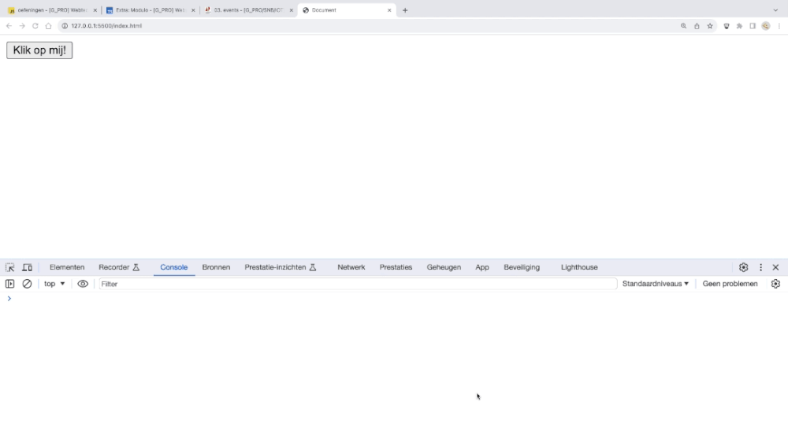
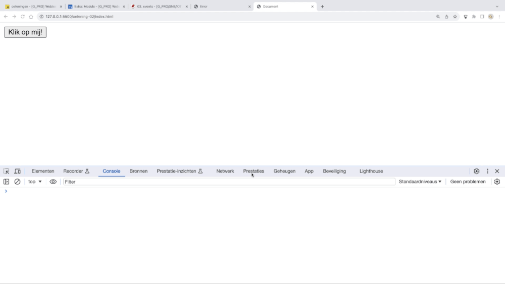
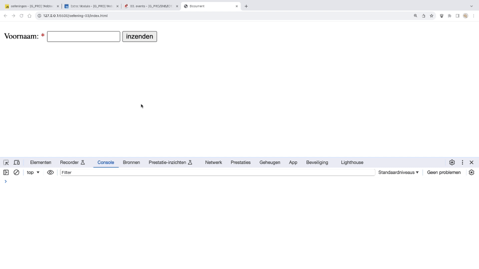
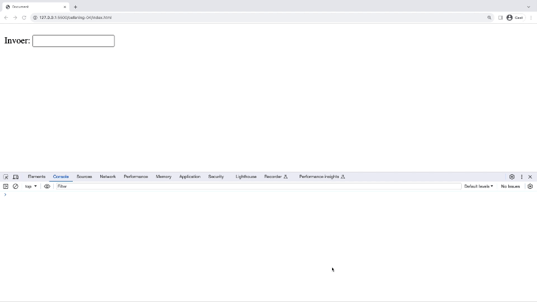
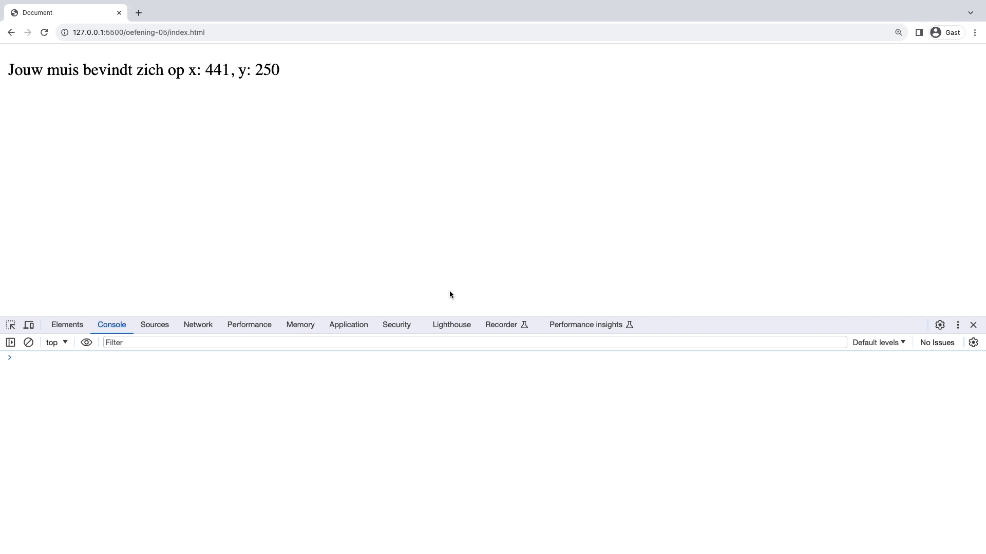
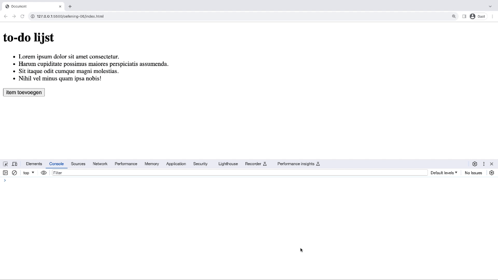
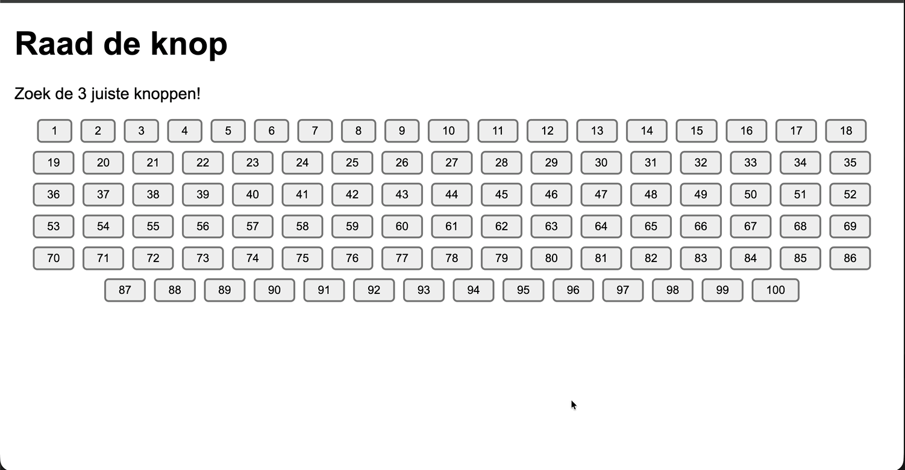

# Labo 18

Zorg dat je de volgende folder structuur volgt:

```
webtechnologie/
├─ labo-01/
│  ├─ oefening-01/
│  │  ├─ index.html
│  │  ├─ images/
│  │  │  ├─ image-1.jpg
│  │  │  └─ image-n.jpg
│  │  ├─ css/
│  │  │   ├─ reset.css
│  │  │   └─ style.css
│  │  └─ js/
│  │     └─ script.js
│  ├─ oefening-02/
│  └─ oefening-n/
├─ labo-02/
└─ labo-n/
```

- Gebruik steeds JS modules om globale variabelen te vermijden (`<script type="module" src="./path/to/script.js"></script>`)
- Volg de [Coding Guidelines](https://apwt.gitbook.io/webtechnologie/coding-guidelines)

## Oefeningen events

### oefening 1: eerste event afhandelen

#### leerdoelen

* kennismaken met een event listener in JavaScript

#### functionele analyse

Reageer op een muisklik op een knop door een bericht in de console weer te geven.

#### technische analyse

In jouw HTML plaats je een button-element met een id, bijvoorbeeld "myAction" en wat tekst, bijvoorbeeld "Klik op mij".

In jouw JavaScript-code selecteer je deze button op basis van het id en voeg je er een event listener aan toe om te reageren op het "click"-event.

Wanneer de knop wordt geklikt, toon dan "er werd op mij geklikt" in de console.

#### voorbeeldinteractie


### oefening 2: reageren in DOM

#### leerdoelen

* kennismaken met een event listener in JavaScript
* DOM-manipulatie naar aanleiding van event

#### functionele analyse

Reageer op een muisklik op een knop door een bericht op de website weer te geven.

#### technische analyse

In jouw HTML plaats je een button-element met een id, bijvoorbeeld "myAction" en wat tekst, bijvoorbeeld "Klik op mij". Daaronder plaats je een p-element met een id, bijvoorbeeld "myText". Je laat de p nog leeg.

In jouw JavaScript-code selecteer je deze button op basis van het id en voeg je er een event listener aan toe om te reageren op het "click"-event.

Wanneer de knop wordt geklikt, toon dan "er werd op mij geklikt" in de p.

#### voorbeeldinteractie



### oefening 3: reageren op form event

#### leerdoelen

* form event gebruiken
* default voorkomen

#### functionele analyse

Wanneer een gebruiker het formulier verzendt, toon je de naam van de gebruiker op het scherm.

#### technische analyse

Op jouw pagina staat een formulier met daarin 1 veld, nl. "voornaam".

Wanneer de gebruiker het veld heeft ingevuld (tip: required) en het formulier verzendt, zal jouw code voorkomen dat het formulier verzonden wordt.

Je toont de ingevulde naam van de gebruiker op het scherm in een welkomstboodschap.

#### voorbeeldinteractie



### oefening 4: reageren op invoer van gebruiker

#### leerdoelen

* keyboard event gebruiken

#### functionele analyse

Wanneer een gebruiker in een invoerveld typt, toon je de toetsaanslagen van de gebruiker op het scherm.

#### technische analyse

Op jouw pagina staat een invoerveld, nl. "input".

Wanneer de gebruiker iets invult, toon je de ingevulde tekst van de gebruiker op het scherm.

#### voorbeeldinteractie



### oefening 5: reageren op muisbeweging

#### leerdoelen

* mouse event gebruiken

#### functionele analyse

Je geeft de positie van de muis weer op het scherm

#### technische analyse

Op jouw pagina staat een tekst, nl.: "Jouw muis bevindt zich op x: 150, y: 300".

Telkens de gebruiker zijn muis beweegt, toon je de nieuwe coördinaten in de tekst.

#### voorbeeldinteractie



### oefening 6: DOM-element toevoegen door te klikken

#### leerdoelen

* DOM manipulatie
* click event

#### functionele analyse

Je voegt lijst-items toe door op een knop te drukken.

#### technische analyse

Jouw website bestaat uit een h1 "todo-lijst" en een oplijsten van enkele to-do's.

Er staat een knop onderaan de lijst. Als op deze knop geklikt wordt, zal er een to-do-item bijkomen op de lijst.

#### voorbeeldinteractie



### oefening 7: raad de knop

#### leerdoelen

* dynamisch DOM-elementen aanmaken en toevoegen
* event listeners toevoegen aan dynamisch aangemaakte elementen
* willekeurige getallen genereren

#### functionele analyse

Er worden 100 knoppen op de pagina geplaatst. Precies 3 ervan zijn de "juiste" knoppen. De gebruiker moet proberen deze te vinden door erop te klikken. Klikken op een juiste knop markeert hem groen en geeft feedback. Klikken op een foute knop geeft een korte rode markering. Wanneer alle 3 juiste knoppen gevonden zijn, verschijnt er een bericht.

#### technische analyse

Bij het laden van de pagina voeg je via JavaScript 100 button-elementen toe aan het element met id `buttonGrid`. Kies willekeurig 3 unieke knoppen die de "juiste" zijn en log hun nummers naar de console.

Voeg aan elke knop een click-event listener toe. Wanneer geklikt:
- Is het een juiste knop: zet `disabled` op de knop, kleur hem groen, en update de statustekst (pas een class toe, bijvoorbeeld `found`, die de groene kleur en eventuele andere stijlen bevat).
- Is het een foute knop: zet `disabled` op de knop en kleur hem rood. (pas een class toe, bijvoorbeeld `miss`, die de rode kleur en eventuele andere stijlen bevat).

Wanneer alle 3 juiste knoppen gevonden zijn, toon je een felicitatiesbericht in het element met id `status`.

#### voorbeeldinteractie
