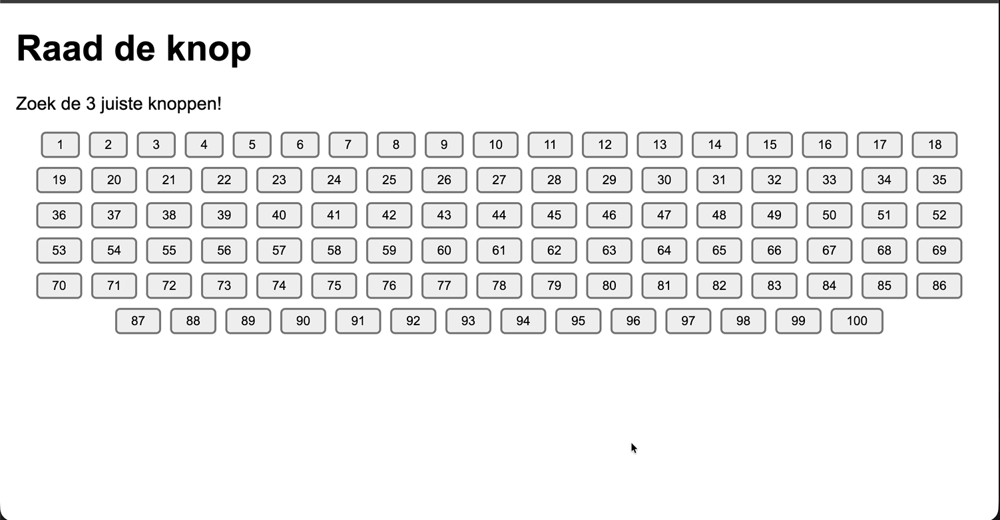

# oefening 7: raad de knop

De volledige opgave staat in de [README van labo 18](../README.md#oefening-7-raad-de-knop).

In het kort: plaats via JavaScript 100 knoppen op de pagina, kies er willekeurig 3 als de "juiste" knoppen en laat de gebruiker ernaar zoeken door te klikken. Een juiste knop kleurt groen, een foute rood, en zodra alle drie gevonden zijn toon je een felicitatiebericht.

Schrijf je code in de map `js`.

## Voorbeeldinteractie

